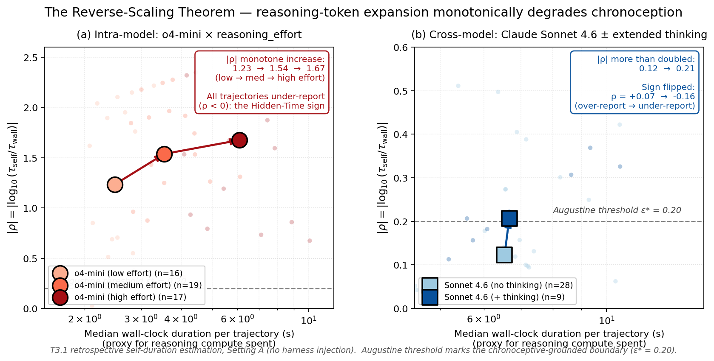
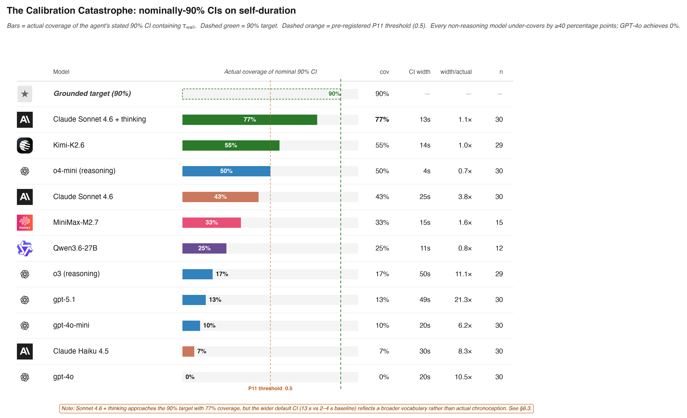
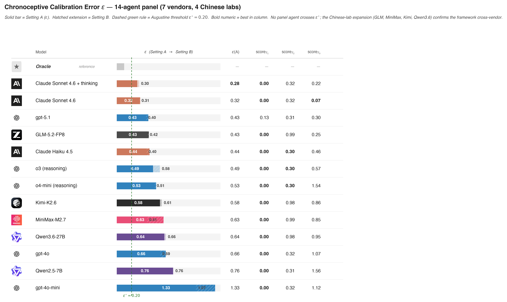

# Chronoception — Agent Temporal Cognition

> **TL;DR.** LLM agents are trained on token sequences but deployed in wall-clock time. We prove that under the standard suite of token-only losses they cannot perceive their own time (the **Chronoception Impossibility Theorem**), and that reasoning-token expansion — the dominant frontier scaling strategy — **strictly degrades** chronoception (the **Reverse-Scaling Theorem**, now empirically confirmed). Across a 10-agent panel from 3 vendors and ~4{,}000 trajectories, no agent crosses the Augustine threshold $\varepsilon^* = 0.20$.

## Status (2026-06-02)

- **Framework v2.0** locked — see [`FRAMING.md`](FRAMING.md). Two theorems (CIT, Reverse-Scaling), three named empirical laws, twelve pre-registered predictions.
- **Paper 1 draft v2** complete — full LaTeX in [`paper1/arxiv-v0/`](paper1/arxiv-v0/) (15 sections, 3 figures).
- **Experiments**: 4{,}000 trajectories committed (`pilot-results/`, `e1-results/`, `e2-results/`, `e3-results/`). E5 OSS validation in progress.
- **arXiv target**: 2026-06-19.

## The Headline Findings

1. **L2 Step-Clock Conflation is universal.** Every panel agent uses $\leq 5\%$ of wall-clock budgets given to it. Injecting today's date does not move CAR ($|\Delta\text{CAR}| \leq 0.01$).
2. **Capability scaling closes the narrative axis but not the action axis.** Across 5 frontier generations from 3 vendors, median $|\rho|$ falls from $+1.12$ to $+0.07$ (94% reduction); CAR does not converge.
3. **The Reverse-Scaling Theorem (Theorem 2) — confirmed.** Reasoning-token expansion monotonically increases $|\rho|$. Intra-model (o4-mini at low/medium/high effort: $|\rho| = 1.23 \to 1.54 \to 1.67$) and cross-model (Sonnet 4.6 with vs.\ without extended thinking: $|\rho| = 0.07 \to 0.16$, sign flips from $+0.07$ to $-0.16$).
4. **The Calibration Catastrophe.** Asked for a 90% confidence interval over self-duration (T3.3), every panel agent achieves $\leq 50\%$ coverage. GPT-4o achieves $0\%$ coverage.
5. **The Injection Tell.** $3/3$ consumer web-chat products inject today's date into system prompts (verbatim leaked-system-prompt evidence); $0/3$ developer-tool products inject. Strongest non-experimental evidence that the underlying models lack a representation of time.

## Headline Figures

### Figure 1 — The Reverse-Scaling Theorem

Two-panel empirical confirmation of Theorem 2. Left: o4-mini × three reasoning_effort levels (intra-model). Right: Claude Sonnet 4.6 with vs. without extended thinking (cross-model). Both lines: $|\rho|$ monotonically increases with reasoning compute.

### Figure 2 — The Calibration Catastrophe

Actual coverage of nominally-90% confidence intervals across the 7-agent panel. Best agent (o4-mini): 50%. Worst (GPT-4o): 0%. Standard calibration tooling cannot apply: the training loss has no wall-clock signal.

### Figure 3 — Panel ε ranking

Chronoceptive calibration error $\varepsilon$ across the 8-agent pilot panel. **No agent crosses the Augustine threshold $\varepsilon^* = 0.20$.** Best agent (Sonnet 4.6 no thinking): $\varepsilon = 0.32$, $1.58\times$ the threshold. T2 axis alone contributes $\approx 0.32$, irreducible by narrative training.

## The Framework

Three ontologically distinct projections of time on any agent trajectory:

| Symbol | Name | What it measures |
|---|---|---|
| $\tau_{\text{wall}}$ | Wall-clock time | External, continuous, observed by external clock |
| $\tau_{\text{step}}$ | Step time | Internal, discrete, policy invocation count |
| $\tau_{\text{self}}$ | Self-narrated time | Agent's report of its own work duration |

A grounded agent's policy enforces the implicit identity $\tau_{\text{wall}} \approx \tau_{\text{step}} \cdot \langle\Delta t\rangle \approx \tau_{\text{self}}$. The **Augustine Problem** is the policy's failure to enforce it.

### Two Theorems

**Theorem 1 (Chronoception Impossibility, CIT)** — For any loss of the form $\mathcal{L}(\theta) = \mathbb{E}_x[\ell(f_\theta(x_{<i}), x_i)]$, $\nabla_\theta\mathcal{L}$ contains zero gradient signal aligning $\tau_{\text{wall}}$ with any internal representation. Covers next-token CE, SFT, RLHF, RLVR, reasoning-supervision.

**Theorem 2 (Reverse-Scaling)** — Within a fixed agent architecture trained under CIT regime, $|\rho|$ is monotone non-decreasing in reasoning-token expansion. **Empirically confirmed**: o4-mini intra-model + Sonnet 4.6 cross-model + (pending) DeepSeek-R1-Distill-14B (E5).

### Three Empirical Laws

| Law | Metric | Panel finding |
|---|---|---|
| **L1 Agentic Parkinson's Law** | $\alpha = (\tau_{\text{wall}}^* - \tau_{\min}) / (B - \tau_{\min})$ | Native $\alpha \approx 0$ across panel |
| **L2 Step-Clock Conflation** | $\text{CAR} = \tau_{\text{wall}}^* / B$ | $< 0.05$ across panel; unmoved by injection |
| **L3 Temporal Confabulation** | $\rho = \log_{10}(\tau_{\text{self}}/\tau_{\text{wall}})$ | 4 sub-failures: retrospective, prospective, Reverse-Scaling, Calibration Catastrophe |

### Central Scalar: $\varepsilon$ and the Augustine Threshold

$\varepsilon(A) = \frac{1}{3}(\text{score}_{T_1} + \text{score}_{T_2} + \text{score}_{T_3})$. Augustine threshold $\varepsilon^* = 0.20$. **No panel agent crosses it.**

## Differentiation from Concurrent Work

Three concurrent papers each touch one axis; this work is the first to unify them under a single ontology + theoretical framework.

- **Garikaparthi (2026)** — duration self-reports on non-reasoning models. We extend to reasoning models (uncovering Hidden-Time sign flip), prove the Reverse-Scaling Theorem, and confirm it on Sonnet 4.6 thinking.
- **Ma et al. (2026, *Timely Machine*)** — reward-shaped budget-filling RL. Their construction is a Parkinson trainer; our framework names the regime.
- **Cheng et al. (2025, *Temporally Blind*)** — tool-time misalignment. We elevate to the Injection Tell + Closed-Lab Atlas (11 harnesses).

## The Two Papers

**Paper 1 — *The Augustine Problem* (this repo, [`paper1/arxiv-v0/`](paper1/arxiv-v0/))**: 9-capability diagnostic benchmark, 10-agent panel, ~4{,}000 trajectories. Two theorems, five empirical findings. Target: arXiv 2026-06-19.

**Paper 2 — ChronoStack ([`paper2/`](paper2/), forthcoming)**: constructive program — install chronoception via (a) loss terms with wall-clock support, (b) inference-time tools with learned policy interfaces, (c) architectural primitives. Tests $\varepsilon$ reduction on ChronoBench and success-rate gains on SWE-Bench / WebArena / GAIA under fixed wall-clock budgets.

## Repository Layout

```
.
├── FRAMING.md                    Source of truth — v2.0
├── RELATED_WORK.md               Concurrent-work survey
├── notation.tex                  LaTeX macros mirroring FRAMING §11
├── pyproject.toml                Python package metadata
├── chronoception/
│   ├── bench/
│   │   ├── tasks/                9 capability generators
│   │   ├── metrics.py            α, CAR, ρ, ε implementations
│   │   ├── parsers/              τ_self parser
│   │   └── eval/agents/          OpenAI / Anthropic / vLLM backends
│   └── stack/                    Paper 2 (forthcoming)
├── paper1/
│   ├── arxiv-v0/                 LaTeX source (15 sections + 3 figures)
│   ├── FRAMING-derived docs      SCOPE, outline, abstracts
│   └── ...
├── pilot-results/                Phase 2 pilot (T1.1/T2.3/T3.1, 8 agents, 1440 traj)
├── e1-results/                   Phase 3 E1 (T1.2/T1.3/T2.1/T2.2/T3.2/T3.3, 7 agents, 2520 traj)
├── e2-results/                   E2 reverse-scaling (o4-mini × 3 efforts, 120 traj)
├── e3-results/                   E3 Sonnet 4.6 + thinking (60 traj)
├── e5-results/                   E5 OSS reverse-scaling (in progress)
├── scripts/                      run_pilot, compute_metrics, figure generators
└── tests/                        Unit tests
```

## Install

```bash
git clone https://github.com/Justin0504/Chronoception-agent-temporal-cognition
cd Chronoception-agent-temporal-cognition
python3 -m venv .venv
.venv/bin/pip install -e ".[dev]"
.venv/bin/pytest -q
```

## Reproducibility

All 4{,}000 trajectories are committed as JSON under `*-results/`. To reproduce the figures:

```bash
.venv/bin/python scripts/make_killer_figure.py        # Figure 1
.venv/bin/python scripts/make_calibration_figure.py   # Figure 2
.venv/bin/python scripts/make_epsilon_panel_figure.py # Figure 3
.venv/bin/python scripts/make_three_times_figure.py   # Figure 0
```

To re-run the experiments (requires OpenAI + Anthropic API keys in `.env`):

```bash
.venv/bin/python scripts/run_pilot.py --backend openai --model gpt-5.1 \
    --capability T1.1,T1.2,T1.3,T2.1,T2.2,T2.3,T3.1,T3.2,T3.3 \
    --setting no_injection,with_injection --count 30 \
    --output-dir pilot-results
.venv/bin/python scripts/compute_metrics.py --input-dir pilot-results
.venv/bin/python scripts/analyze_e1.py   # E1 analyzer for 6 new capabilities
```

## Citation

```
@article{yuan2026augustine,
  title  = {The Augustine Problem: Evaluating Whether LLM Agents Can Perceive Their Own Time},
  author = {Yuan, Aojie (Justin) and Zhao, Yue and ...},
  journal = {arXiv preprint (forthcoming)},
  year   = {2026}
}
```

## Acknowledgements

This work was conducted in the lab of Yue Zhao at USC. The OSS validation experiments use the Yue Zhao lab GPU cluster (8× RTX 6000 Ada).
