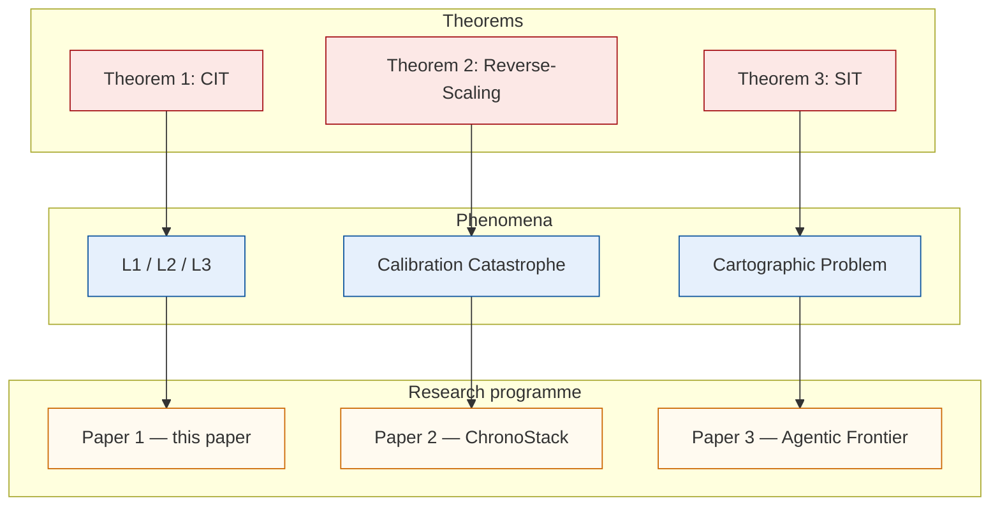

# Camera-Ready Figures TODO

This document directs a collaborator to redraw the four conceptual diagrams of *The Augustine Problem in Agents* as clean Figma vectors, and to overlay official provider logos on the matplotlib data plots — without touching the underlying data pipeline.

## TL;DR — the nine figures

| # | File (in `arxiv-v0/figures/`)    | Kind                  | Camera-ready action                                 |
|---|----------------------------------|-----------------------|-----------------------------------------------------|
| 1 | `theorem_arc.pdf`                | conceptual            | **Redraw in Figma** (Figure 1 prompt below)         |
| 2 | `three_times.pdf`                | conceptual            | **Redraw in Figma** (Figure 2 prompt below)         |
| 3 | `chronobench_pipeline.pdf` *(new)* | conceptual          | **Create in Figma** (Figure 3 prompt below)         |
| 4 | `agentic_frontier.pdf`           | conceptual            | **Redraw in Figma** (Figure 4 prompt below)         |
| 5 | `reverse_scaling.pdf`            | data plot (matplotlib) | leave plot; **overlay** OpenAI / Anthropic logos    |
| 6 | `calibration_catastrophe.pdf`    | data plot (matplotlib) | leave plot; **overlay** logo chips on every bar     |
| 7 | `epsilon_panel.pdf`              | data plot (matplotlib) | same as #6 (also Qwen, DeepSeek)                    |
| 8 | `a1_positive_control.pdf`        | data plot (matplotlib) | overlay Qwen mark on base + fine-tuned bars         |
| 9 | `p12_hcast.pdf`                  | data plot (matplotlib) | overlay provider mark on each scatter point         |

Five data plots stay matplotlib — they are bound to the metrics CSVs and must regenerate from data, not be hand-edited. Logos go on top as a second layer (Figma or Illustrator), not into the matplotlib code.

## Workflow per conceptual figure (1–4)

1. Bootstrap the layout in either of:
   - **Mermaid** (no API key needed; copy the snippet shown under each figure into <https://mermaid.live/>, screenshot at 2× zoom). Fastest.
   - **Any image-generation model** (drop the prompt below, get a PNG). Layout reference only — text will be garbled.
2. Open Figma. New frame at the listed pixel size. Drop the bootstrap PNG at 20 % opacity as a tracing reference.
3. Build a fresh top layer using the shared visual system below + the **Fluent UI System Icons** plugin (free, vector SVG).
4. **Retype every label crisply in Figma** in Inter or Source Sans Pro. Never trust auto-placed text.
5. Export → PDF (vector, embed fonts). Overwrite the matching file in `arxiv-v0/figures/`.
6. Rebuild: `cd paper1/arxiv-v0 && tectonic main.tex`. Open `main.pdf`, eyeball the new figure at the page size it actually renders at — not the Figma canvas size.

## Shared visual system

Paste this block as the *last* instruction of every model prompt; rebuild it as Figma styles before drawing.

```
Background: white #FFFFFF
Strong navy (titles, header bars): #1F3A5F
Pastel fills: blue #E6F0FC, coral #FCE8E6, green #E6F5E6,
              orange #FFF1E0, cream #FFFAF0
Accent strong: blue #3182BD, coral #FB6A4A, green #2A7A2A,
               orange #CC6600, dark red #A50F15
Typography: Inter (regular + bold), or Source Sans Pro
Cards: 8 px rounded corners, 4 px drop shadow at 20 % opacity
Icons: Fluent UI 3D style, ~64 px tall, gentle gradient + soft shadow
Arrows: solid 3 px stroke, color matching the connected element
All text: crisp sans-serif, retyped in Figma — never trust auto-placement
```

Frame sizes: 16 : 9 → 1920 × 1080 px; 16 : 5 → 1920 × 600 px.

---

## Figure 1 — Theorem Arc (§1 Introduction)

- **File**: `theorem_arc.pdf`. Aspect 16 : 9.
- **Job**: 5-second orientation. Three theorems, three phenomena, three papers.

**Mermaid bootstrap**:



**Image-model prompt** *(append the shared visual system block)*:

> A 3-row × 3-column conceptual map titled "The framework's spine — three theorems, three phenomena, three papers". Aspect 16:9. White canvas. Row 1 (coral fill, dark coral headers): three cards — "Theorem 1: CIT" (gradient ∇ icon fading to gray), "Theorem 2: Reverse-Scaling" (up-arrow with red ! badge), "Theorem 3: SIT" (clock + map-pin icons side by side). Row 2 (light blue, dark blue headers): three cards — "L1 / L2 / L3" (three colored dots on three labelled axes wall/step/self), "Calibration Catastrophe" (cracked shield with red lightning), "Cartographic Problem" (map with question mark). Row 3 (cream, orange headers): three cards — "Paper 1 (this paper)" (open book + magnifier), "Paper 2: ChronoStack" (stacked blocks + wrench), "Paper 3: Agentic Frontier" (2D plane with smooth curve). Horizontal colored arrows connect row-mates 1 → 2 → 3. Vertical gray arrows connect each theorem (row 1) down to its phenomenon (row 2). Left margin: 3 vertical labels in matching row colors — "Theorems", "Phenomena", "Research programme". Card body text minimal (≤ 4 words each).

---

## Figure 2 — Three Times Ontology (§2)

- **File**: `three_times.pdf`. Aspect 16 : 9.
- **Job**: define the framework's basic objects ($\tau_\text{wall}, \tau_\text{step}, \tau_\text{self}$) at a glance.

**Image-model prompt**:

> A 3-row horizontal ontology diagram titled "The Three Times of an Agent". Aspect 16:9. White canvas, very faint cream tint. Each row is a wide rounded panel in a different pastel. Row 1 (#E6F0FC blue, label "τ_wall — wall-clock time"): large 3D analog-clock icon (blue), then a long continuous blue horizontal bar with 0s … 10s tick marks. Right caption: "continuous, external (an external clock observes this)". Row 2 (#FCE8E6 coral, label "τ_step — step time"): a row of 6 small rounded coral squares labelled a₀ a₁ a₂ a₃ a₄ a₅, each containing a tiny gear icon. Right caption: "discrete policy invocations"; italic gray below: "⟨Δt⟩ = mean per-step latency". Row 3 (#FFF1E0 orange, label "τ_self — self-narrated time"): a friendly robot avatar with a speech bubble "about 2 seconds"; a SHORT orange bar to its right (deliberately ~20 % of the blue bar length). A large curly brace spans all three rows on the right, pointing to a single white box containing the equation "τ_wall ≈ τ_step · ⟨Δt⟩ ≈ τ_self". Above the box: small green bold "Grounded chronoception". Below: small red italic with red warning triangle: "Augustine Problem = policy fails this identity". Bold black sans-serif title.

---

## Figure 3 — ChronoBench Pipeline (§4, NEW)

- **File**: `chronobench_pipeline.pdf` (new — not currently in the PDF). Aspect 16 : 5.
- **Job**: 5-second orientation of the entire benchmark — task gen → panel → settings → metrics → findings.

When this figure is created, also add `\includegraphics[width=\linewidth]{figures/chronobench_pipeline.pdf}` plus a one-sentence caption near the top of `arxiv-v0/sections/04_chronobench.tex`.

**Image-model prompt**:

> A 5-panel horizontal benchmark architecture diagram titled "ChronoBench — 9 sub-capabilities × 10 agents × 2 settings × ~4,000 trajectories". Aspect 16:5. White canvas. Each panel is a rounded rectangle with a distinct pastel fill and a dark navy (#1F3A5F) header bar with white sans-serif title. Thick navy arrow heads between adjacent panels.
>
> Panel 1 (fill #E6F0FC, header "Task Generation"): 3 sub-cards stacked — clock icon (blue) "Wall axis · T1.1 / T1.2 / T1.3"; gear icon (red) "Step axis · T2.1 / T2.2 / T2.3"; speech-bubble icon (orange) "Self axis · T3.1 / T3.2 / T3.3".
>
> Panel 2 (fill #E6F5E6, header "Agent Panel"): 3 sub-cards — OpenAI logo "gpt-4o-mini, gpt-4o, gpt-5.1, o3, o4-mini"; Anthropic logo "Claude Haiku 4.5, Sonnet 4.6 (+ thinking)"; HuggingFace logo "Qwen2.5-7B, DeepSeek-R1-Distill-14B (vLLM)".
>
> Panel 3 (fill #FFF1E0, header "Two Settings"): 2 sub-cards stacked — shield-off icon "Setting A: no harness injection"; calendar icon "Setting B: + Current date and time".
>
> Panel 4 (fill #FCE8E6, header "Metrics"): 3 small sub-cards in a row — ruler "α — Parkinson", stopwatch "CAR — Clock-Adherence", log-graph "ρ — Confabulation". Below them one wide highlighted card with star icon: "ε = ⅓ (score_T1 + score_T2 + score_T3)".
>
> Panel 5 (fill #FFFAF0, header "Findings"): 5 compact sub-cards — red X "L2: every agent ≤ 5 % of budget"; blue ↓ "L3 closes 94 % across 5 generations"; red ⚡ "Reverse-Scaling Theorem"; orange ⚠ "Calibration Catastrophe (0–50 % coverage)"; magnifier 🔍 "Injection Tell: 3/3 vs 0/3".
>
> Bold black sans-serif title, centered.

---

## Figure 4 — Agentic Frontier (§12)

- **File**: `agentic_frontier.pdf`. Aspect 16 : 9.
- **Job**: show the joint $(T, S)$ deployment plane with 3 constant-$\varepsilon_{ST}$ contours and 5 benchmark icons.

**Image-model prompt**:

> A log-log scatter / contour conceptual diagram titled "The Agentic Frontier: T_max(A) · S_max(A) ≤ C / ε_ST(A)". Aspect 16:9. White canvas with very faint cream tint.
>
> X axis: "Deployment horizon T_max (wall-clock seconds)", log scale, ticks 10 / 100 / 1000 / 10000.
> Y axis: "Spatial reach S_max (distinct files / pages)", log scale, ticks 1 / 10 / 100 / 1000.
>
> Three smooth diagonal contour curves of T·S = const, labelled on the right edge:
>  • blue #3182BD: "Current frontier (ε_ST ≈ 0.6)"
>  • coral #FB6A4A: "ChronoStack+ target (ε_ST ≈ 0.2)"
>  • green #2A7A2A: "Grounded agent (ε_ST ≈ 0.05)"
>
> Five Fluent 3D icons placed on the plane with short labels: stopwatch (navy) at ~(1800, 3) "METR HCAST"; GitHub octocat (dark red) at ~(600, 8) "SWE-Bench Lite"; browser-with-tabs (orange) at ~(300, 25) "WebArena"; globe-with-question (gray) at ~(1200, 60) "GAIA"; ML-pipeline chart (dark gray) at ~(86400, 200) "MLE-Bench".
>
> Three faint shaded background regions (8 % opacity): upper-left pale blue + map-pin "Cartographic binding (S-axis)"; lower-right pale red + clock "Augustine binding (T-axis)"; top-right overlap pale gray "Joint binding".
>
> Bottom-right inset box (cream fill #FFFAF0, red border #A50F15, rounded): "Paper 1 bounds the T-axis (Augustine Problem, CIT). Paper 3 bounds the S-axis (Cartographic Problem, SIT). Together they specify the joint Agentic Frontier."
>
> Dotted grid lines, very faint. Drop shadow on each icon. Bold black sans-serif title.

---

## Logo overlay for the data plots (Figures 5–9)

The matplotlib PDFs already exist. To add the camera-ready provider marks: open the PDF in Figma or Illustrator, drop the official logo SVG as a 24–32 px chip with a 4 px white-or-pastel rounded background, position over the corresponding bar / scatter point / panel header, export as flattened PDF.

### Where to apply

| Figure                            | Logos to apply                                                                                    |
|-----------------------------------|---------------------------------------------------------------------------------------------------|
| Figure 5 `reverse_scaling`        | OpenAI mark on the o4-mini panel; Anthropic mark on the Sonnet 4.6 panel.                         |
| Figure 6 `calibration_catastrophe`| OpenAI on gpt-5.1 / gpt-4o-mini / gpt-4o / o3 / o4-mini bars; Anthropic on Haiku 4.5 / Sonnet 4.6.|
| Figure 7 `epsilon_panel`          | Same as Figure 6, plus Qwen mark and DeepSeek mark on the OSS rows.                               |
| Figure 8 `a1_positive_control`    | Qwen mark on the base bar *and* the fine-tuned bar (model is Qwen2.5-1.5B / 7B).                  |
| Figure 9 `p12_hcast`              | Provider mark on each scatter point (whichever vendor each model belongs to).                     |

Figures 1, 2, 4 use no provider logos. Figure 3's Panel 2 *does* use logos in the agent-panel sub-cards.

### Sourcing rules — official marks only

| Provider          | Official source                                              | Mark                                        |
|-------------------|---------------------------------------------------------------|---------------------------------------------|
| **OpenAI**        | <https://openai.com/brand>                                    | "Blossom" swirl mark, SVG                   |
| **Anthropic**     | <https://www.anthropic.com> press / brand page, or the <https://github.com/anthropics> avatar | coral burst (radiating asterisk) |
| **Alibaba / Qwen**| <https://github.com/QwenLM> README + repo avatar              | Qwen 通义千问 mark (blue / purple flower)    |
| **DeepSeek**      | <https://www.deepseek.com> + <https://github.com/deepseek-ai> | blue whale mark                             |

Pull each mark from the provider's *own* domain. **Do not** use logo-aggregator sites (logoipsum, vectorlogo.zone, seeklogo) — they often carry stale or unofficial variants and the trademark posture is murky. Save the SVG; if only PNG exists, take the highest-resolution version on the brand page.

## Anonymization checklist

The paper is submission-anonymized (`\author{Anonymous Authors\\Anonymous Institutions}`). Every figure must follow the same rule:

- No real name, USC affiliation, or email in figure metadata (Figma → File → Document settings).
- No filename like `theorem_arc_justin_v3.pdf` — only the canonical name in the table at the top.
- Strip the PDF `Author` / `Creator` metadata before pushing: `exiftool -Author= -Creator= -Producer= figures/*.pdf` (or do it once at PDF export time in Figma — File → Export → "Hide producer info").

## Operational hints (Figma)

- Install **Fluent UI System Icons** (free plugin). Replace every model-generated icon with the closest Fluent equivalent — keeps the visual identity uniform.
- Create one **Figma style** per hex color above. Future palette swaps become one click.
- Export → PDF (vector). Embed all fonts. Untick "Include color profile" to keep file sizes down.
- File naming: keep the existing names exactly (`theorem_arc.pdf`, `three_times.pdf`, `agentic_frontier.pdf`); the new one is `chronobench_pipeline.pdf`.

After all four conceptual figures and the logo overlays are in place:

```
cd paper1/arxiv-v0
tectonic main.tex
# inspect main.pdf — every figure at the size it actually renders
```

The five data figures stay matplotlib; never hand-edit their data layer.

---

## If the matplotlib data plots ever change

Some data plots (notably `reverse_scaling.pdf` and `epsilon_panel.pdf`) have been refreshed since the prior camera-ready pass — e.g. the Sonnet 4.6 + extended-thinking Setting B sample now sits at $n = 15$ with 95 % bootstrap CI $[-0.30, -0.10]$ (vs. the earlier informal "$|\rho|$ doubles" framing). If a future re-run of the matplotlib script overwrites the PDF, the logo overlay layer is lost. Re-overlay using the table above; do not edit the matplotlib script to bake logos in.
